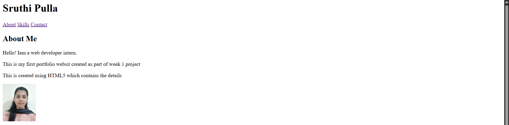

# Personal Portfolio Website – Week 1

## Project Overview
-This project is a Personal Portfolio Website created using HTML5.
-The purpose of this project is to learn the basic structure of a web page
-and practice fundamental HTML concepts.

## Objectives
-Understand HTML document structure
-Use semantic HTML tags
-Create multiple sections in a webpage
-Add images and internal navigation
-Build a basic contact form

## Technologies Used
-HTML5
-Visual Studio Code
-Web Browser

## Project Structure
index.html  
README.md  
images/

## Setup Instructions
1.Install Visual Studio Code
2.Create a project folder
3.Open the folder in VS Code
4.Create index.html file
5.Write HTML code
6.Open index.html in browser

## HTML Concepts Learned
-HTML page structure
-Semantic tags like header, nav, section, footer
-Headings, paragraphs, lists
-Images with alt attributes
-Forms and input validation
-Internal navigation links

## Visual Documentation

### Home Page

### Skills Section

### Contact Form

## Technical Details
-This is a static HTML website.
-No algorithms or data structures are used.
-The project follows a single-page structure.

## Testing Evidence

### Test Case 1: Website Load
-Action: Opened index.html in a web browser
-Expected Result: Website loads without errors
-Status: Passed

### Test Case 2: Navigation Links
-Action: Clicked About, Skills, and Contact links
-Expected Result: Page scrolls to correct section
-Status: Passed

### Test Case 3: Image Loading
-Action: Checked profile image display
-Expected Result: Image loads correctly with alt text
-Status: Passed

### Test Case 4: Contact Form Validation
-Action: Submitted form without filling required fields
-Expected Result: Browser shows validation error
-Status: Passed

### Test Case 5: HTML Validation
-Action: Validated HTML using W3C Validator
-Expected Result: No critical HTML errors
-Status: Passed